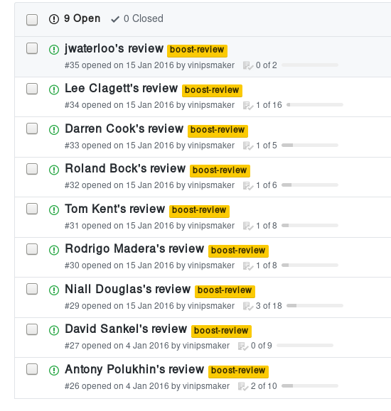

# História

* (ainda mais experiência prévia...)
* 2014!
* Google Summer of Code 2014.
* Usado em placas ARM e MIPS para a [solução de áudio multi-sala
  Dynastrom](http://dynastrom.com/).
* Reprovado pela revisão Boost em 2015.
* Boost Summer of Code 2016.

# História

