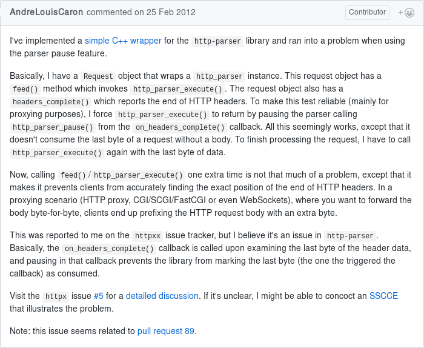

# NodeJS

Detalhes completos:
<https://vinipsmaker.wordpress.com/2016/08/05/boost-http-has-a-new-parser/>

---

* Callbacks (nada de inline).
* Precisa compilar.
* Não suporta métodos HTTP arbitrários.
* ...

---

> it can be interrupted at anytime



Issue #97.

---

HTTP pipelining: Um método que funciona:

```cpp
int on_message_complete(http_parser *parser) {
  // ...
  return -1;
}

void run_parser() {
  if (parser.http_errno) {
    // ...
    } else if (parser.http_errno == cb_message_complete) {
      http_parser_init(parser);
    }
  }
}
```

# Gerenciamento de HTTP headers

callback model + appending everywhere + non-separate steps for matching and
decoding:

---

```cpp
if (value.size() /* last header piece was value */) {
  trim_right_if(socket->last_header.second, [](char ch) {
      return ch == ' ' || ch == '\t';
    });
  if (parser->http_minor != 0
      || (field != "expect" && field != "upgrade")) {
    (socket->use_trailers ? message->trailers()
     : message->headers()).insert(socket->last_header);
  }
  value.clear();

  field.replace(0, field.size(), at, size);
  transform(field.begin(), field.end(), field.begin(),
            tolower);

  if (socket->use_trailers
    && socket->istate != http::read_state::body_ready) {
    socket->istate = http::read_state::body_ready;
  }
} else {
  auto offset = field.size();
  field.append(at, size);
  auto begin = field.begin() + offset;
  transform(begin, field.end(), begin, tolower);
}
```

# NodeJS parser

Mais problemas? Pode apostar.

# Boost.Http time!

# Bonus

```
include/boost/http/syntax
├── chunk_size.hpp
├── content_length.hpp
├── crlf.hpp
├── field_name.hpp
├── field_value.hpp
├── ows.hpp
├── reason_phrase.hpp
└── status_code.hpp
```

# Futuro

* Parser combinators.
* Generators.
